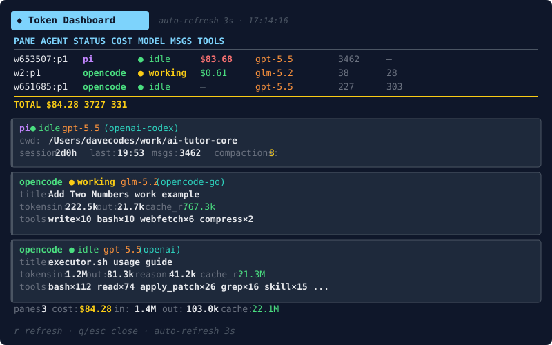

# ◆ Herdr Token Dashboard

A [Herdr](https://herdr.dev) plugin that shows **live token spend** across all your agent panes and sends **cost notifications** when agents finish.



## Features

- **Live dashboard** — Bubble Tea TUI with Lip Gloss styling, auto-refreshing every 3 seconds
- **Per-agent breakdown** — cost, tokens (input/output/reasoning/cache), model, provider, session duration, message count, tool call stats
- **Cost notifications** — Herdr native toast when an agent transitions to `done`, with cost and token summary
- **Multi-agent support** — tracks [Pi](https://github.com/nicepkg/pi), [OpenCode](https://opencode.ai), [Claude Code](https://claude.com/claude-code), and [Codex](https://github.com/openai/codex) agent sessions
- **Keybinding** — `prefix+$` opens the dashboard instantly

## Data Sources

| Agent | Source | What's Read |
|-------|--------|-------------|
| Pi | Session JSONL (`agent_session.path`) | `sessionCostUsd`, model from `model_change`, message count, compaction count, session duration |
| OpenCode (active) | Server API `http://127.0.0.1:4096/session/{id}` | Live cost, full token breakdown, model, provider, message count, tool calls |
| OpenCode (completed) | Disk fallback `~/.local/share/opencode/storage/message/{id}/` | Same data from persisted message files |
| Claude Code | Session transcript `~/.claude/projects/{project}/{session-id}.jsonl` | Full token breakdown (input/output/cache read/cache write), estimated cost, model, message count, tool calls, session duration |
| Codex | Rollout `~/.codex/sessions/YYYY/MM/DD/rollout-*-{session-id}.jsonl` | Full token breakdown, estimated cost, model, message count, tool calls, session duration |

### Claude Code

Claude Code panes are matched by their Herdr `agent_session` (source `herdr:claude`) and read from the session transcript JSONL that Claude Code writes under `~/.claude/projects/`. The transcript directory is derived from the pane's working directory; if that lookup misses (e.g. the pane changed directories after launch), the dashboard falls back to searching all project directories for the session ID.

Streamed and retried transcript entries are deduplicated per assistant message, so token counts reflect actual API usage.

> **Note:** Claude Code transcripts don't record cost, so the dashboard computes an **estimate** from a built-in pricing table (per-MTok list rates for current Anthropic models, including cache read/write multipliers). Unknown models show tokens but no cost. Rates live in one table in `main.go` and are easy to update.

### Codex

Codex panes are matched by their Herdr `agent_session` (source `herdr:codex`) and read from the rollout JSONL under `~/.codex/sessions/` (or `$CODEX_HOME/sessions`). The session ID is matched on the rollout filename; if that misses, the `session_meta` line is read instead.

Two Codex-specific details:

- Codex reports **cumulative** totals on every `token_count` event, so the last event wins rather than being summed.
- Codex's `input_tokens` is **inclusive** of `cached_input_tokens`, unlike the other sources here. The cached portion is subtracted so the IN and CACHE columns mean the same thing for every agent and the totals row stays additive.

Cost is estimated from a second table of OpenAI list rates, scoped to the `gpt-5` family that Codex runs. Those models price cached input at 0.1x input and cache writes at 1.25x — the same multipliers the Anthropic table uses — so both providers share one cost function. Older families are deliberately omitted: `gpt-4.1` caches at 0.25x and `gpt-4o` at 0.5x, so costing them with these multipliers would be wrong, and no rate is better than a wrong one.

> **Note:** long-context rates (roughly double) are not modelled. They apply above a context length larger than the window Codex reports (258,400 for `gpt-5.6-sol`), so a Codex turn cannot reach that tier.

## Install

### From GitHub

```bash
herdr plugin install Davidcreador/herdr-token-dashboard
```

### From local clone

```bash
git clone https://github.com/Davidcreador/herdr-token-dashboard.git
cd herdr-token-dashboard
./scripts/build.sh
herdr plugin link .
```

## Usage

### Open the dashboard

```bash
herdr plugin action invoke dave.token-dashboard.open-dashboard
```

Or use the keybinding: `prefix+$`

### Dashboard controls

| Key | Action |
|-----|--------|
| `q` / `esc` | Close dashboard |
| `r` | Manual refresh |
| Auto | Refreshes every 3 seconds |

### Notifications

The dashboard monitors agent status during its poll cycle. When any agent pane transitions from `working`/`idle` to `done`, it sends a Herdr native toast notification:

```
✅ opencode done: $0.61
Pane w2:p1 · msgs:38 · in:222.5k out:21.7k
```

> **Note:** The dashboard must be open for notifications to fire. The manifest also declares a `pane.agent_status_changed` event hook for future compatibility when Herdr adds manifest event dispatch for pane events.

## What the Dashboard Shows

### Summary Table

| Column | Description |
|--------|-------------|
| PANE | Compact pane ID |
| AGENT | Agent name (pi / opencode / claude / codex) |
| STATUS | Current agent status with colored dot |
| COST | Session cost (green <$5, yellow <$25, red >$25) |
| MODEL | Current model in use |
| MSGS | Total message/turn count |
| TOOLS | Total tool calls |

### Per-Agent Detail Cards

Each agent gets a detail card showing:

- **Model + provider** — which model and provider the agent is using
- **Session title** — OpenCode session title
- **CWD** — current working directory
- **Session duration** — total time since session start
- **Last activity** — timestamp of last interaction
- **Token breakdown** — input, output, reasoning, cache read, cache write
- **Messages** — total assistant turns
- **Compactions** — Pi context compaction count
- **Tool breakdown** — per-tool call counts (e.g., `bash×112  read×74  edit×26`)

## Build

```bash
./scripts/build.sh
```

Requires [Go](https://go.dev/) 1.22+.

## Updating the README image

The preview image is generated from a real Herdr dashboard pane capture, not hand-drawn.

```bash
herdr plugin action invoke dave.token-dashboard.open-dashboard
herdr pane read <dashboard-pane-id> --source visible --ansi > /tmp/dashboard.ansi
scripts/capture-dashboard-preview.py /tmp/dashboard.ansi docs/dashboard-preview.svg
```

## Requirements

- [Herdr](https://herdr.dev) 0.7.0+
- [Go](https://go.dev/) 1.22+ (for building from source)
- [Pi](https://github.com/nicepkg/pi), [OpenCode](https://opencode.ai), and/or [Claude Code](https://claude.com/claude-code) running in Herdr panes

## Plugin Manifest

```toml
id = "dave.token-dashboard"
name = "Token Dashboard"
version = "0.1.0"
min_herdr_version = "0.7.0"
description = "Live token spend dashboard + cost notifications for Herdr agent panes"
platforms = ["macos", "linux"]
```

## Architecture

```
herdr pane list
    ↓
for each agent pane:
    Pi       → read JSONL → extract sessionCostUsd, model, messages, compactions
    OpenCode → query server API (127.0.0.1:4096) → extract cost, tokens, tools
              ↳ fallback to disk reads for completed sessions
    Claude Code → read transcript JSONL (~/.claude/projects) → extract tokens,
                  model, messages, tools; estimate cost from pricing table
    ↓
aggregate per pane / workspace / total
    ↓
Bubble Tea + Lip Gloss TUI renders:
    - summary table (cost, tokens, model, messages, tools)
    - per-agent detail cards
    - workspace totals
    ↓
poll loop detects status transitions → herdr notification show
```

## License

MIT

## Contributing

This is a personal utility plugin. If you find issues or want to extend it, feel free to open a discussion or PR.
